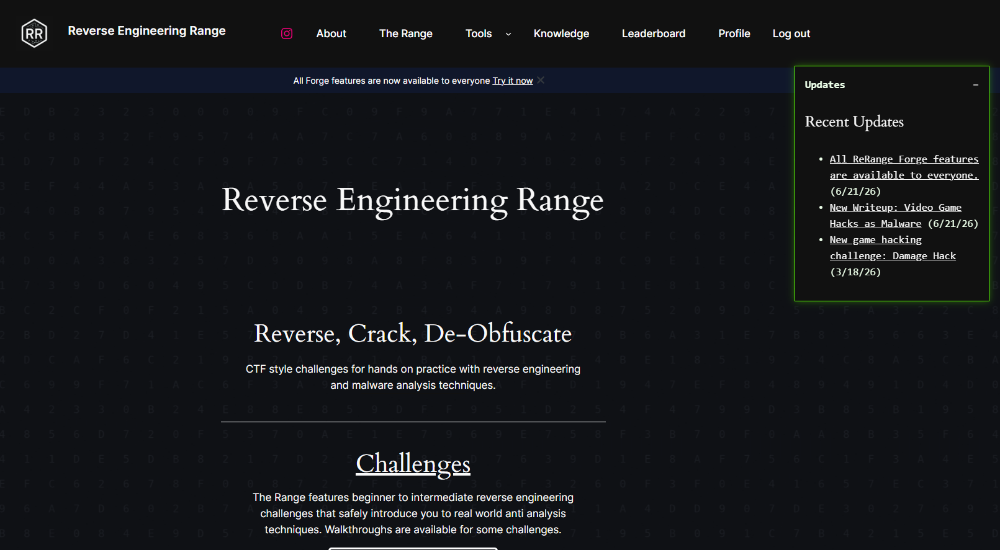
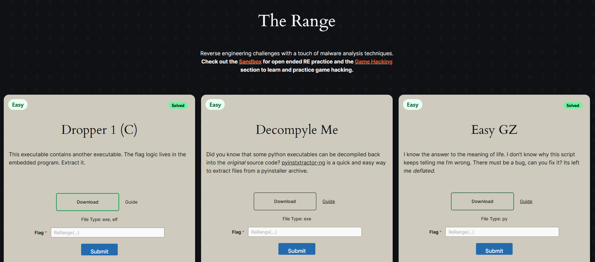
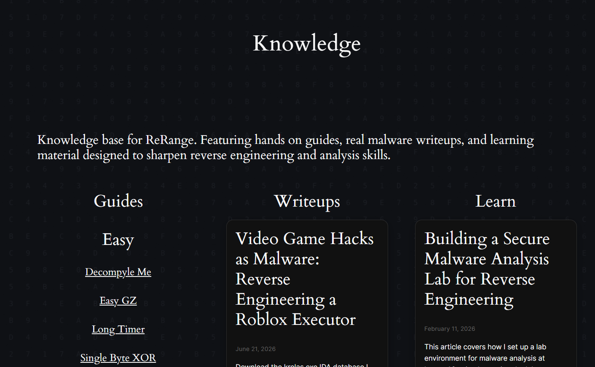
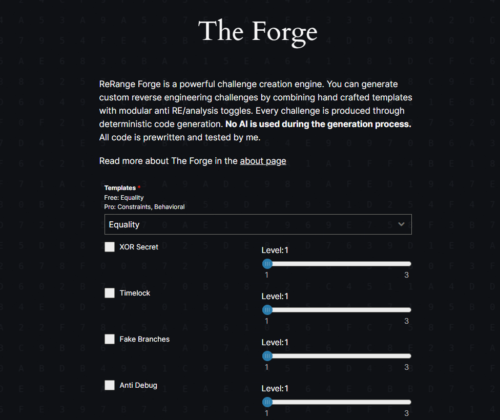
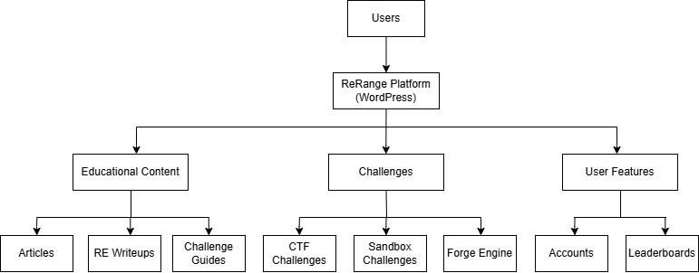

<h1 align="center">ReRange</h1>

  ReRange is an educational platform focused on reverse engineering and malware analysis. It provides hands-on challenges, walkthroughs, malware research writeups, and interactive tooling designed to help users safely explore binary analysis and software internals.

  

## Features
- Reverse engineering challenges ranging from beginner to intermediate difficulty
- Open-ended sandbox binaries designed for experimentation and exploration
- Step-by-step challenge walkthroughs and educational writeups
- Malware reverse engineering reports and research articles
- Forge challenge generator for producing unique reverse engineering exercises
- User accounts, challenge tracking, and community leaderboards

## Technical Highlights
- Designed and deployed a production website using WordPress
- Developed custom plugins and backend services to support challenge generation and user interactions
- Built an interactive challenge generation system (Forge) capable of producing configurable reverse engineering exercises
- Designed educational content focused on malware analysis and binary reverse engineering
- Independently designed, deployed, and maintained the platform and its custom integrations.

## Screenshots

<table>
  <tr>
    <td align="center">
       
      Home page
    </td>
    <td align="center">
       
      Challenge library
    </td>
  </tr>
  <tr>
    <td align="center">
       
      Knowledge base
    </td>
    <td align="center">
       
      Forge challenge generator
    </td>
  </tr>
</table>

<h2>Architecture</h2>

  

  High-level architecture of ReRange and its educational, challenge, and community components.

## Future Improvements

- Additional challenge templates and sandbox programs
- Expanded malware analysis writeups
- Additional educational tooling and learning resources
- Enhanced progression tracking and statistics
